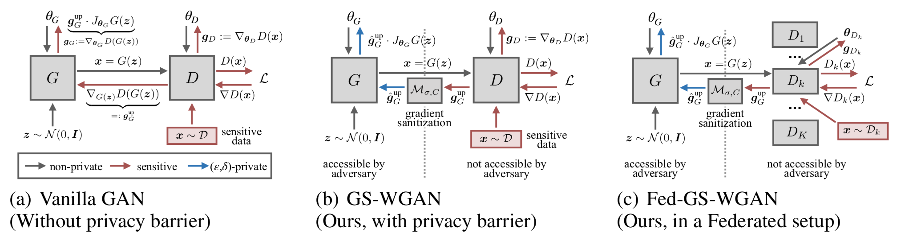

# GS-WGAN


This repository contains the implementation for [GS-WGAN: A Gradient-Sanitized Approach for Learning Differentially Private Generators (NeurIPS 2020)](https://arxiv.org/abs/2006.08265).

## Setup
If access to a supercomputer is possible follow the steps below. Contrarily, we need to prevent any lack of quality in training the frameworks and thus it is highly recommended to proceed with Transfer Learning.

You can download the pre-trained models using the links [below](#pre-trained-models). 


## Requirements
Note: Setup the conda environment incase you are running the program locally. Otherwise (Using Param Ganga/Google Colab/Kaggle) directly execute:
```
pip install -r requirements.txt
```
The environment can be set up using [Anaconda](https://www.anaconda.com/download/) with the following commands:

``` setup
conda create --name gswgan-pytorch python=3.6
conda activate gswgan-pytorch
conda install pytorch=1.2.0 
conda install torchvision -c pytorch
pip install -r requirements.txt
```


## Training 
#### Step 1. To warm-start the discriminators:
```warm-start
cd source
sh pretrain.sh
```
- To run the training in parallel: adjust the 
`'meta_start'` argument and run the script multiple times in parallel.
   
#### Step 2. To train the differentially private generator:
```train
cd source
python main.py -data 'mnist' -name 'ResNet_default' -ldir '../results/mnist/pretrain/ResNet_default'
```
- Please refer to `source/config.py` (or execute `python main.py -h`) for the complete list of arguments. 

- The default setting require ~22G GPU memory. Please allocate multiple GPUs by specifying the `'-ngpus'` argument if   it does not fit in the memory of one GPU. 

## Evaluation
#### Privacy
- To compute the privacy cost:
    ```privacy 
    cd evaluation
    python privacy_analysis.py -data 'mnist' -name 'ResNet_default'
    ```

#### Utility
- To evaluate downstream sklearn classifiers: \
The evaluation results will be saved to `'#dirname(gen_data.npz)#/eval/sklearn'` by default.
    ```sklearn
    cd evaluation
    python eval_sklearn.py --gen_data './../results/mnist/main/ResNet_default/gen_data.npz' -data 'mnist'
    ``` 

- To evaluate downstream CNN classifiers: \
The evaluation results will be saved to `'#dirname(gen_data.npz)#/eval/cnn'` by default:
    ```cnn
    cd evaluation
    python eval_cnn.py --gen_data './../results/mnist/main/ResNet_default/gen_data.npz' -data 'mnist'
    ``` 
  
- To evaluate the MNIST Inception Score: 
    ```IS
    cd evaluation
    ```
    1. Train a classifier on real data. The model will be saved to `'evaluation/models/'` by default:
        ```IS
        python train_mnist_inception_score.py -data 'mnist'
        ```
    2. Load the pre-trained classifier and evaluate IS. The evaluation result will be saved to `'#dirname(gen_data.npz)#/eval/IS/'` by default:
        ```IS
        python eval_mnist_inception_score.py -data 'mnist' --gen_data './../results/mnist/main/ResNet_default/gen_data.npz'
        ```
       
- To evaluate the FID (requires installing [TensorFlow](https://www.tensorflow.org/): \
    The evaluation results will be saved to `'#dirname(gen_data.npz)#/eval/FID/'` by default.
    ```FID
    cd evaluation
    python eval_fid.py -data 'mnist' --gen_data './../results/mnist/main/ResNet_default/gen_data.npz' 
    ```

## Pre-trained Models
Pre-trained model checkpoints can be downloaded using the links below. The discriminators are obtained after the 
warm-starting step (step 1), while the generators are obtained after the DP training step (step 2). 
The pre-trained models are stored as `.pth` files and the corresponding training configurations are stored in 
`params.pkl` and `params.txt`. 

|   |Generator  | Discriminators |  
|---|---|---|
|MNIST | [link](https://drive.google.com/drive/folders/19KaZouarxgo7qgH76aNTxYj2OTvqS7lL?usp=sharing) | [link](https://drive.google.com/drive/folders/1gg_pq5BkbexJgfuEzGd4fRCTAaLKVWQK?usp=sharing) | 
|Fashion-MNIST | [link](https://drive.google.com/drive/folders/1JzGFeFzyIQ_UuOtv3-XF7BjcrUG2I5jR?usp=sharing) | [link](https://drive.google.com/drive/folders/1XoWjS1cbG4Bihg5abOSvlf3r2MbkqPoL?usp=sharing) | 


## Setup for Transfer Learning Approach
As a reference to the environment I have added the environment [yml file](https://github.com/AggarwalManav/GS-WGAN_Differential_Privacy/blob/main/environment_droplet.yml) as in a conda environment via the `condacolab` library.
-Link to the library guide : [condacolab](https://saturncloud.io/blog/how-to-install-conda-package-to-google-colab/) 
Although, colab has an inbuilt capable environment and you can directly begin with the steps below.<br/>
For training with pretrained discriminators: you could run the training script (i.e., `source/main.py`) by specifying the `--load_dir` to be the directory where you store the downloaded pretrained discriminators (it could be like `'results/mnist/pretrain/ResNet_default'`):
- Download the pre-trained models and form a folder hierarchy in your google drive identical to the [drive link](https://drive.google.com/drive/folders/1zOq3j9sgb3a6ckE7CYdVuoQTgI6C-ogo?usp=sharing) shared and place the downloaded models in their respective places.
- Now download and upload the shared [colab implementation](https://github.com/AggarwalManav/GS-WGAN_Differential_Privacy/blob/main/GS-WGANs_Colab_Implementation.ipynb) on your drive.
- You are now ready with all the tools.
- Go ahead and run the code which has stepwise implementation of all terminal functions. Achieved results can be viewed in the drive folders formed as well.

> Note: Be sure to modify file addresses in the code as per variations in your folder hierarchy. It is suggested to replicate it according to the drive link provided. 


